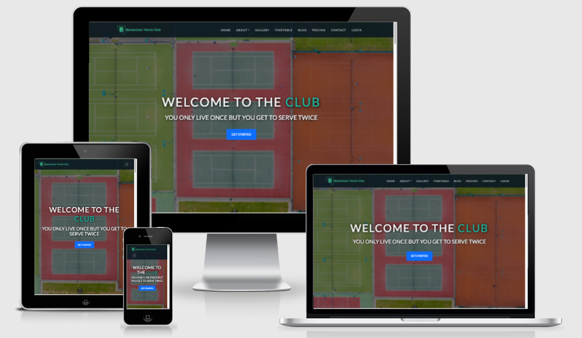

<h1 align="center">Welcome to Beckenham Tennis Club</h1>

[View the live project here.](https://philipwilliams0.github.io/BeckenhamTennisBTC/)

> `Welcome again to Beckenham Tennis Club. This is a club for everyone, the perfect place if you are starting out in tennis or if you are seasoned player, a place to play competitive tennis all year round. The website provides users with a modern, clear, intuitive experience but also gives the user appealing design and a can do to achieve greater things. You'll like Beckenham Tennis because you can easily navigate the website.  

<h2 align="center"></h2>

___

## User Experience (UX)

- ### User stories
  - #### First Time Visitor Goals

        1. As a First Time Visitor, I want to understand the website quickly and learn more detail about the organisation.
        2. As a First Time Visitor, I want to know who the pro tennis coaching staff are.  
        3. As a First Time Visitor, I want to know which surface(s) you can play on.
        5. As a First Time Visitor, I want to know what else does the organisation offer.

  - #### Returning Visitor Goals

        1. As a Returning Visitor, I want to find information about classes being held.
        2. As a Returning Visitor, I want to find the best way to contact the site owner with any questions I may have.

  - ##### Frequent User Goals

        1. As a Frequent User, I want to check the timetable for any updates and/or changes.
        2. As a Frequent User, I want to check for new blogs or social media.  
        3. As a Frequent User, I want to sign up to the Newsletter so that I am emailed any major updates and/or changes.

- ###  Design

  - #### Color Scheme
    - The three main colours used are green, grey and white.

  - #### Typography
    - I’ve chosen [Google font Lato](https://fonts.google.com/specimen/Lato?preview.text_type=custom#about) serious but friendly and a typeface that would seem quite “transparent” when used in body text but would display some original traits when used in larger sizes. I used classical proportions (evident in the uppercase) to give the letterforms familiar harmony and elegance. The semi-rounded details of the letters give Lato a feeling of warmth, while the strong structure provides stability and seriousness.

  - #### Imagery
    - Imagery is essential and needed to be modern but appeal to all users with an engaging can do feel.

- ### Wireframes
  - Desktop Wireframe - [View](https://github.com/PhilipWilliams0/BeckenhamTennisBTC/blob/main/assets/wireframe/Desktop%20Wireframe%20BTC.pdf)

  - Tablet Wireframe - [View](https://github.com/PhilipWilliams0/BeckenhamTennisBTC/blob/main/assets/wireframe/tablet%20Wireframe%20BTC.pdf)

  - Mobile Wireframe - [View](https://github.com/PhilipWilliams0/BeckenhamTennisBTC/blob/main/assets/wireframe/mobile%20Wireframe%20BTC.pdf)

- ### Features

  - Responsive on all device sizes

  - Interactive elements

  - Login page for existing users

## Technologies Used

### Languages Used

- [HTML5](https://en.wikipedia.org/wiki/HTML5)
- [CSS3](https://en.wikipedia.org/wiki/Cascading_Style_Sheets)

### Frameworks, Libraries & Programs Used

1. [Bootstrap 5.0.0:](https://getbootstrap.com/docs/5.0/getting-started/introduction/)
    - Bootstrap was used to assist with the responsiveness and styling of the website.
1. [Google Fonts:](https://fonts.google.com/)
    - Google fonts were used to import the 'Lato' font into the style.css file which is used on all pages throughout the project.
1. [Font Awesome:](https://fontawesome.com/)
    - Font Awesome was used on all pages throughout the website to add icons for aesthetic and UX purposes.
1. [Git](https://git-scm.com/)
    - Git was used for version control by utilizing the terminal to commit to Git and Push to GitHub.
1. [GitHub:](https://github.com/)
    - GitHub is used to store the projects code after being pushed from Git.
1. [unsplash:](https://unsplash.com/)
    - unsplash was used for its ease of use resizing images.
1. [balsamiq:](https://balsamiq.com/)
    - Balsamiq was used to create the [wireframes](https://github.com/PhilipWilliams0/BeckenhamTennisBTC/tree/main/assets/wireframe) during the design process.

### Languages Used

- [HTML5](https://en.wikipedia.org/wiki/HTML5)
- [CSS3](https://en.wikipedia.org/wiki/Cascading_Style_Sheets)

### Frameworks, Libraries & Programs Used

1. [Bootstrap 5.0.0:](https://getbootstrap.com/docs/5.0/getting-started/introduction/)
    - Bootstrap was used to assist with the responsiveness and styling of the website.

## Testing

The W3C Markup Validator and W3C CSS Validator Services were used to validate the project to ensure there were no syntax errors in the project.

- [W3C Markup Validator](https://jigsaw.w3.org/css-validator/#validate_by_input)

    <h2 align="center"></h2>

    <h2 align="center"></h2>

- [W3C CSS Validator](https://jigsaw.w3.org/css-validator/#validate_by_input)

    <h2 align="center"></h2>

    <h2 align="center"></h2>

### Testing User Stories from User Experience (UX) Section

- #### First Time Visitor Goals

    1. As a First Time Visitor, I want to understand the website quickly and learn more detail about the organisation.

        - User is greeted with a visually engaging ariel view of the complex, along with a navbar, caption and a call to action button.  
        - User is presented with 3 options to progess, they can use the navigation bar, call to action button or scroll. 

        <h2 align="center"></h2>

    2. As a First Time Visitor, I want to know who the pro tennis coaching staff are.  
        
        - The site has been designed to provide user(s) with as much information but from research 

        <h2 align="center"></h2>

    3. As a First Time Visitor, I want to know which surface(s) you can play on.

        - 

        <h2 align="center"></h2>

    4. As a First Time Visitor, I want to know what else does the organisation offer.

        <h2 align="center"></h2>>

- #### Returning Visitor Goals

    1. As a Returning Visitor, I want to find information about classes being held.

        <h2 align="center"></h2>

    2. As a Returning Visitor, I want to find the best way to contact the site owner with any questions I may have.

        <h2 align="center"></h2>

- ##### Frequent User Goals

    1. As a Frequent User, I want to check the timetable for any updates and/or changes.

        <h2 align="center"></h2>

    2. As a Frequent User, I want to check for new blogs or social media.  

        <h2 align="center"></h2>

    3. As a Frequent User, I want to sign up to the Newsletter so that I am emailed any major updates and/or changes.

        <h2 align="center"></h2>

### Further Testing

- The Website was tested on Google Chrome, Internet Explorer, Microsoft Edge and Safari browsers.
- The website was viewed on a variety of devices such as Desktop, Laptop, iPhone SE, iPhone 8 & iPhoneX.
- A large amount of testing was done to ensure that all pages were linking correctly.
- Friends and family members were asked to review the site and documentation to point out any bugs and/or user experience issues.

### Known Bugs

- On some mobile devices the hamburger toggle is pushed underneath the logo - Fixed by reducing the navbar-brand logo to 2.5rem on smaller devices
- Meet the Team Cards will be out of alignment on tablet screens
- buttons under timetable section go across full screen on phone devices. 
- Newsletter email field losses left/right border on phone devices

## Deployment

### GitHub Pages

The project was deployed to GitHub Pages using the following steps...

1. Log in to GitHub and locate the [GitHub Repository](https://github.com/)
2. At the top of the Repository (not top of page), locate the "Settings" Button on the menu.
    - Alternatively Click [Here](https://raw.githubusercontent.com/) for a GIF demonstrating the process starting from Step 2.
3. Scroll down the Settings page until you locate the "GitHub Pages" Section.
4. Under "Source", click the dropdown called "None" and select "Master Branch".
5. The page will automatically refresh.
6. Scroll back down through the page to locate the now published site [link](https://github.com) in the "GitHub Pages" section.

### Forking the GitHub Repository

By forking the GitHub Repository we make a copy of the original repository on our GitHub account to view and/or make changes without affecting the original repository by using the following steps...

1. Log in to GitHub and locate the [GitHub Repository](https://github.com/)
2. At the top of the Repository (not top of page) just above the "Settings" Button on the menu, locate the "Fork" Button.
3. You should now have a copy of the original repository in your GitHub account.

### Making a Local Clone

1. Log in to GitHub and locate the [GitHub Repository](https://github.com/)
2. Under the repository name, click "Clone or download".
3. To clone the repository using HTTPS, under "Clone with HTTPS", copy the link.
4. Open Git Bash
5. Change the current working directory to the location where you want the cloned directory to be made.
6. Type `git clone`, and then paste the URL you copied in Step 3.

```
git clone https://github.com/PhilipWilliams0/BeckenhamTennisBTC
```

7. Press Enter. Your local clone will be created.

```
$ git clone https://github.com/PhilipWilliams0/BeckenhamTennisBTC   
> Cloning into 'BeckenhamTennisBTC'...
> remote: Enumerating objects: 508, done.
> remote: Counting objects: 100% (508/508), done.
> remote: Compressing objects: 100% (369/369), done.
> remote: Total 508 (delta 181), reused 455 (delta 131), pack-reused 0
> Receiving objects: 100% (508/508), 27.82 MiB | 7.48 MiB/s, done.
>Resolving deltas: 100% (181/181), done.
```

Click [Here](https://help.github.com/en/github/creating-cloning-and-archiving-repositories/cloning-a-repository#cloning-a-repository-to-github-desktop) to retrieve pictures for some of the buttons and more detailed explanations of the above process.

## Credits

### Code

- The full-screen hero image and caption code came from [Drew Ryan](https://www.youtube.com/channel/UCtXGz0MBuqZUC8rmGddc07Q)

- [Bootstrap5](https://getbootstrap.com/docs/5.0/getting-started/introduction/): Bootstrap Library used throughout the project mainly to make site responsive using the Bootstrap Grid System and scrolling effect that would only have been acheived using JS otherwise. 


### Content

- All content was written by the developer.

### Media

- All Images were created by the developer.

### Acknowledgements

- My Mentor Gerry McBride for continuous helpful feedback.

- Tutor support at Code Institute for their support.
